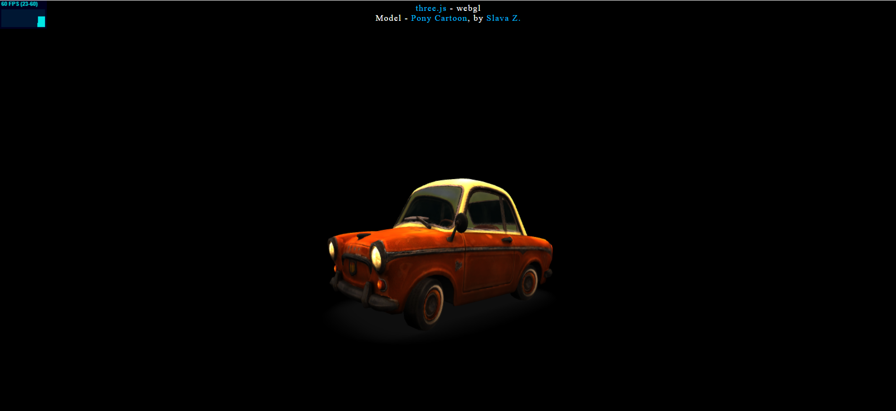

<h1>Animação 3D utilizando three.js</h1>
<h3>Recursos utilizados: </h3>
<ul>
  <li>JavaScript ; </li>
  <li>three.js ;</li>
  <li>HTML ;</li>
  <li>CSS ;</li>
</ul>

  O projeto visa exemplificar a utilização de alguns dos recursos básicos da biblioteca de JavaScript, three.js. Como por exemplo: Renderizadores, câmeras, luzes, loaders, dentre outros. 
  A construção da animação se dá a partir do carregamento de um modelo 3D em formato GLB (créditos reservados ao autor). 

